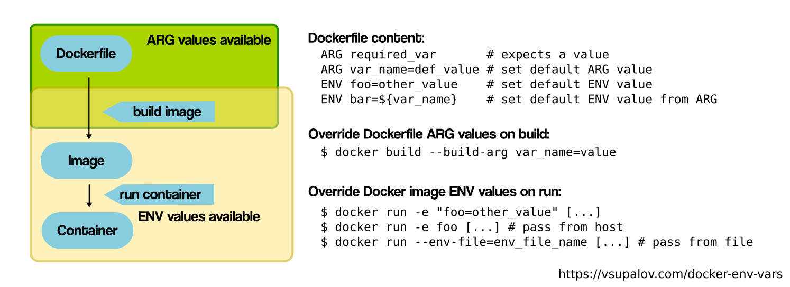

# Docker 基本運作

## Dockerfile

從無到有依據需求創建能夠運作的 Container，   
要有依據需求設計的 Dockerfile，   
再經由 Docker build 將 Dockerfile 建置成 image，   
最後 Docker run 將 image 執行成 container。

>   
> [Docker ARG, ENV 有什麼不同: Docker image 與 container 的建構流程](https://blog.scottchayaa.com/post/2018/11/04/docker-arg-env-variable/)

## Docker PUSH