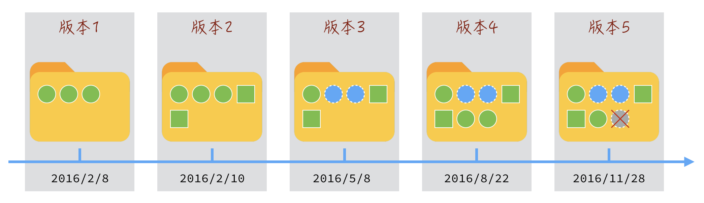
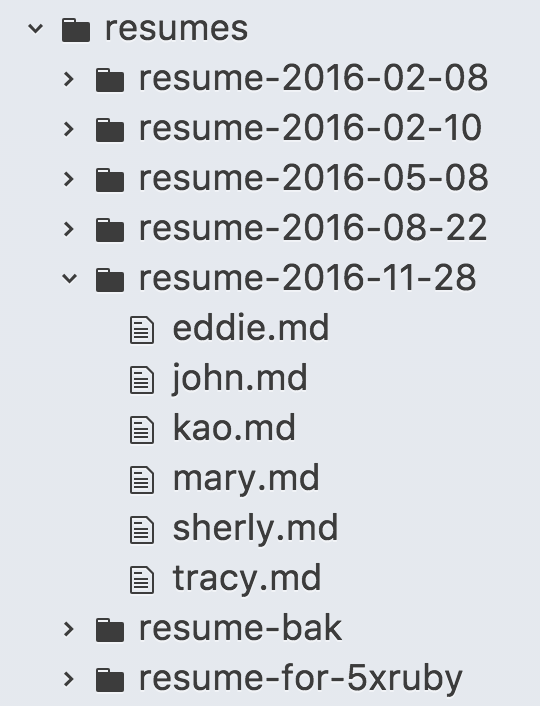

# Git basic knowladge
Git 是一款版本控管框架，且已經成為現今市場的主流，所有的軟體都透過 Git 的相關延伸做版本控管，因此我們要先了解版本控管。
# 為什麼要做版本控管
版本控管的目的很簡單，就是針對每次更新改版，為了確保每一次更動，不至於導致不可恢復的結果，因此版本控管就誕生了。
  
然而衍伸出的問題也不只如此，一款大型專案不可能只有一個開發者，因此在合作時，必須要有一套邏輯去統整大家寫的 code，去避免發生每次把 code 互相合併時發生衝突。    
每次當有人想加入進行更新時，也可以隨時取得在管理處取得最新版本的程式，再進行開發，避免許多重工的問題。

那我們為什麼需要 `git`，傳統的版本控管做法是把檔案照這樣貼，我相信大家都有經歷過這樣的事情:
  
即便命名成這樣肉眼就能分辨時間與版本，但是在比較版本間的不同，與復原特定區塊程式時，卻不是這麼方便，僅能稱作檔案管理。   
選擇 `Git` 的原因便是因為它提供了簡單、快速、輕量的框架，在不造成負擔的情況下又能幫助開發者做到:
- 取得或上傳你的代碼
- 依據版本管理代碼
- 逐版本 highlight 不同處讓 code review 更加效率
- 以分支(branch)的概念，輔助合作開發

# Git 是什麼

1. 免費、開源的版本控管軟體，base on Linux
2. 速度快、體積小
3. 分散式系統，不需總是與伺服器做溝通，儘管仍有共用的伺服器，但是在不使用 push 指令上傳到代碼倉庫前，所有的 local 版控都是無需網路連線的

# Git 基本指令

`Git` 雖然有 command line interface 供使用者從 Terminal 進行操作，但是若不太熟悉 command line 也無須擔心，現在有很多軟體代為操作這些指令，只須熟悉指令代表的意涵即可。

push pull fetch checkout merge

# Branch 的概念
